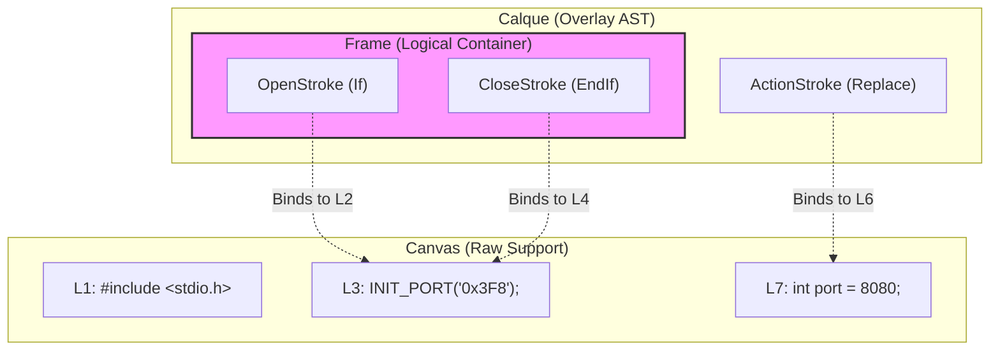
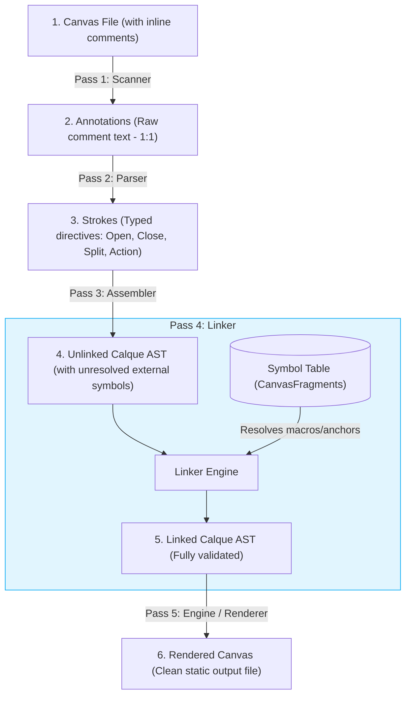

# Meeting: 2026-07-19 - Stream Pipeline Architecture & Carton Refinements

## Metadata
* **Date**: July 19, 2026 (Late-night design session)
* **Participants**: gpineda (Ouvrage Lead / Architect), Gemini (AI Exoskeleton / Design Partner)
* **Topic**: Formalizing the Ostream stream protocol, Canvas/Calque envelope-payload mapping, and Carton's role as the project orchestrator.
* **Status**: Decided and locked.

---

## 1. The Ostream Protocol (x-yaml Stream Specification)

To enable robust, pipe-friendly, and network-transparent interactions across the Ouvrage ecosystem, we formalize the **Ostream Protocol**.

The stream is a sequence of YAML documents separated by `---` (mime-type: `application/x-yaml`). Instead of base64-encoding raw payloads inside JSON/YAML fields, we separate metadata (envelopes) from content (payloads) to ensure zero-copy routing and high parsing efficiency.

### 1.1 The "Envelope + N Payloads" Pattern
Every logical resource in the stream is serialized as a group of documents:
1.  **The Envelope (1 document)**: A Kubernetes-style YAML resource (e.g. `kind: Canvas`, `kind: Calque`, `kind: CartonConfig`). It contains the `apiVersion`, `kind`, `metadata` (activity logs, paths), and `spec` (specifying how many payload documents follow it).
2.  **The Payloads (N documents)**: The raw textual or binary content of the resource (e.g. raw code lines, flat list of strokes, or encrypted secrets).

### 1.2 Resynchronization and Recovery
If a payload document gets corrupted or truncated during network transit or disk I/O, the parser can safely resynchronize:
*   The envelope declares the exact number of payloads $N$ in its specification.
*   In case of a parsing error in a payload, the parser can skip $N$ documents in the YAML stream to land precisely on the next envelope resource.

---

## 2. Operational Modes (Referenced vs. Embedded)

The stream supports two modes of representing source templates (Canvases):

### 2.1 Referenced Mode (Lightweight)
Used for local development and standard CI/CD. Source files are read from the local file system (VFS) rather than embedded in the stream.
*   **Envelope (`kind: CanvasReference`)**: Contains the relative file path and a SHA-256 hash.
*   **Payload 1 (`kind: Calque`)**: The associated Calque containing the extracted or companion strokes.
*   *No Code Payload is embedded.* The compiler reads the file from disk, verifies its hash, and compiles.

### 2.2 Embedded Mode (100% Hermetic)
Used for sharing a complete codebase, archiving, or running stateless builds.
*   **Envelope (`kind: Canvas`)**: Contains the metadata path.
*   **Payload 1 (`kind: Calque`)**: The associated Calque.
*   **Payload 2 (Raw Text)**: The entire raw code content of the template.

---

## 3. Carton & Ostream Roadmap (V1 vs. Future)

To maintain a fast and focused delivery for the first release, we refine the boundaries between Carton, Ostream, and the ocalque compiler:

### 3.1 Carton's Role
**Carton** is specifically the **ocalque project scheduler** (analogous to `docker-compose` for `docker`). 
*   It reads `carton.yaml`, discovers templates in a repository, resolves variable context, and outputs the initial Ostream containing all the Canvas and Calque assets.
*   It is not a generic "ostream scheduler". It is dedicated to ocalque's multi-file execution logic.

### 3.2 Ostream Implementation Strategy
*   **V1 Scope**: The stream parsing and processing logic (reading and writing Canvas/Calque envelopes and payloads) will live **directly inside the `ocalque` repository**. We will not create an external library or daemon yet.
*   **Future Scope**: Once other tools in the Ouvrage guild (such as `olutrin`, `hid-declarative`, or `doc-etl`) need to communicate via this stream format, the Ostream scanner and pipeline logic will be extracted into a dedicated shared library (e.g. `github.com/ouvrage-systems/ostream-go`) and a potential daemon (`ostream run`).

---

## 4. VFS Memory Optimization & Selective Streaming

To prevent excessive memory consumption when compiling large codebases, we reject buffering all raw canvas payloads in the VFS simultaneously. Instead, the VFS is treated as an **on-demand, selective compilation cache**:

*   **Streaming by Default ($O(1)$ RAM)**: For passes that do not require external cross-references (Scan, Parse, Assemble), the compiler streams documents unitarily. Raw payloads are processed and immediately flushed to `stdout` and freed from memory.
*   **Selective VFS Populating**: For passes that require symbol lookups (Link, Render), the compiler retains only the lightweight **metadata envelopes** and **AST structural signatures** (e.g., macro declarations) in the VFS memory index. Heavy payloads (such as raw template code) are immediately discarded from RAM once their metadata is indexed.

---

## 5. The Linker Pass (Pass 4) & Symbol Resolution

We introduce a dedicated **Linker Pass (Pass 4)** in the compiler pipeline. Its sole responsibility is to resolve external references (such as imported macros and anchors) across the ASTs of different files:

1.  **Pure Functionality**: The Linker does not perform disk I/O or run compilation passes on dependencies. It expects all imported ASTs to be pre-loaded in the VFS. If a dependency is missing, it fails with a `"Missing symbol"` link error.
2.  **Signature Verification**: The Linker validates that called macros exist and that the calling arguments match the macro definitions (types, counts, required parameters).
3.  **`LinkGraph` Output**: Upon successful link resolution, the compiler can output a `LinkGraph` (or `DependencyGraph`) document as the first resource in the output stream. This provides:
    *   An audit trail of resolved symbols.
    *   A Directed Acyclic Graph (DAG) defining the correct compilation/deployment execution order.

---

## 6. Macros as CanvasFragments

To preserve the strict separation of concerns between code (Canvas) and directives (Calque), macros are represented as **CanvasFragments** (miniature Canvas + Calque pairs representing the macro body code and its inner strokes):

*   **In-Memory Extraction**: When parsing an imported file, the compiler extracts the macro body lines into a local **Canvas** and the inner directives into a local **Calque**, saving them in a Symbol Table. The original file is then purged from the VFS.
*   **Stream Export (V2)**: The `CanvasFragment` can be serialized as a first-class document kind in the Ostream protocol, allowing teams to share modular macro packages without distributing the full source code.

---

## 7. Macro Call Binding (Static vs. Dynamic Linking)

We aligned on **Strategy C** for handling variable interpolation in macro names (e.g., calling `@ocq:Call(macro="${env.MACRO}")`):

*   **By Default (Safe Static Mode)**: Strictly enforce **Strategy B**. Macro names in calls must be static literals. This allows the Linker (Pass 4) to statically guarantee that 100% of calls are valid and secure before code generation.
*   **Future Opt-in (Dynamic Mode)**: Add a command-line flag (e.g. `--allow-dynamic-linking`) enabling **Strategy A**. The Linker defers validation to the Render pass (Pass 5). Since rendering occurs Ahead-of-Time in the CI/CD pipeline (labnet), any missing macro resolution will safely fail the build pipeline before it reaches production.

---

## 8. Visual Architecture & Pipeline Map

### 8.1 The Drafting Table Metaphor

This diagram illustrates the relationship between physical code lines (Canvas) and logical compilation instructions (Calque, Strokes, Frames).



### 8.2 The 5-Pass Compilation Pipeline

This diagram shows how information flows and matures through the five compilation passes:



---

## 9. Non-Polymorphic Grammar Rule (Repeat vs. Loop)

To eliminate parsing ambiguity, improve static validation, and reduce developer cognitive load, we reject polymorphic directives (e.g. allowing `Loop` to act as both a Block and an Inline). We establish a strict mapping of keywords to syntactic roles:

### 9.1 Block Directives (Always scope-inducing Frames)
*   **Keywords**: `Loop`, `For`, `Count`, `If`, `Macro`, `Section`.
*   **Behavior**: These keywords are parsed as `OpenStroke` roles. They **must** have a matching typed closing tag (`EndLoop`, `EndFor`, `EndIf`, etc.) to seal their boundaries.
*   **Scope**: They wrap multiple CanvasLines and nested Strokes.

### 9.2 Inline Directives (Always single-target ActionStrokes)
*   **Keywords**: `Repeat`, `Replace`, `Strip`, `Inject`, `Indent`, `Call`.
*   **Behavior**: These keywords are parsed as `ActionStroke` roles. They have no closing tags and target only the immediate next line of the Canvas.
*   **Repeat vs. Loop**: We introduce the **`Repeat`** keyword as the strict inline counterpart of `Loop` to repeat a single line. It requires `in`, `var`, and `replace` properties.

---

## 10. Frame Pipelines & Scoped Mutations (Brainstorming)

We explored advanced features to reduce boilerplate in large configuration files and enable programmatic transformations on code regions (Frames) without annotating every line:

### 10.1 `Meta` Injection (Provenance & Audit Comments)
The `@ocq:Meta` directive can be used to inject metadata (such as ownership, compliance rules, or versioning) as native comments in the rendered output file:
```yaml
# @ocq:Meta(owner="sre-team", compliance="pci-dss", inject=true)
```
When `inject=true` is set, the compiler translates the metadata into the target language's comment format (e.g., `#` for YAML, `/* */` for C) and writes it to the output, creating a clean audit trail.

### 10.2 Scoped Frame Pipelines as Recursive ASTs
Rather than inventing a custom pipeline-specific syntax, a `Frame` (such as `Section`) can declare a `pipeline` consisting of **nested AST nodes** (reusing existing directives like `If`, `Loop`, `Replace`, `Append`):
```yaml
# @ocq:Section(name="db_config", pipeline=[...])
```
During the rendering pass (Pass 5), the engine loops over each `CanvasLine` in the Frame and recursively evaluates the pipeline AST within that line's context.

### 10.3 Positional Context Variables
When evaluating the pipeline AST for a `CanvasLine`, the engine exposes temporary positional variables:
*   **`pos`**: The 1-based index of the current line within the Frame.
*   **`rpos`**: The reverse 1-based index (e.g., `-1` for the last line, `-2` for the second to last).
*   **`line`**: The metadata of the current `CanvasLine` (e.g., `line.content`, `line.indent`).

### 10.4 Block-Level Pipeline Execution & `ForEachLine`
To avoid using awkward conditions like `when=(pos == 1)` for block boundaries and to keep the pipeline clean, we align on the following execution model:
*   **Block-Level by Default**: A Frame's pipeline executes at the **Block level**. Directives like `Prepend` and `Append` run exactly once at the boundaries of the Frame (start and end).
*   **Explicit Line Loop (`ForEachLine`)**: To apply a mutation line-by-line, the pipeline must explicitly declare a `ForEachLine` node. This loops sequentially over every line in the block, applying nested mutations:
```yaml
pipeline=[
  Prepend(content="# --- START COMPLIANCE ---"), # Runs once at start
  ForEachLine(nodes=[
    Append(content=" # compliance-approved")     # Runs on every line
  ]),
  Append(content="# --- END COMPLIANCE ---")       # Runs once at end
]
```

### 10.5 Pipeline Loop Duplication
Since the pipeline is a full AST, it can contain a `Loop` or `Repeat` node. This allows a pipeline to loop over a single `CanvasLine` and duplicate it into multiple rendered lines:
```yaml
pipeline=[
  Loop(in=env.PORTS, var="p", nodes=[
    Replace(with="  - port: ${p}")
  ])
]
```

### 10.6 Stateful Variable Propagation (Stateful Pipelines)
By preserving the Frame's local mutable scope across line iterations, variables can be modified on line $i$ and read on line $i+1$, enabling sequential increments (e.g. IP/port mappings).

### 10.7 Fractal Pipeline Nesting (Recursive Unrolling)
Because the pipeline is represented as a standard AST, nodes inside a pipeline (such as a nested `Loop` or `For`) can *themselves* declare a `pipeline` attribute. 

This enables a **fractal compilation model**: during the rendering pass, the engine evaluates the nested loop, and for each iteration, recursively unrolls and evaluates its inner pipeline. This allows SREs to declare deeply nested, multi-level infrastructure topologies programmatically while keeping the compiler's core evaluation engine purely recursive and simple.

### 10.8 Language-Agnostic Core & File-Level Parser Configuration
To ensure `ocalque` remains a pure, language-agnostic compiler, it must not hardcode target language syntaxes (such as Bash backslash line continuations or C comment syntax). We resolve this with two design choices:

1.  **File-Level Configuration (`@ocq:Config`)**: A file can declare its parsing rules at the very top, telling the Scanner how to interpret comments and line continuations:
    ```bash
    # @ocq:Config(comment_style="#", line_continuation="\\")
    ```
2.  **Explicit Multi-line Targeting (`lines=N`)**: For a simple, grammar-free override of multiline blocks, directives (like `Replace` or `Strip`) can explicitly declare the number of physical target lines to consume:
    ```bash
    # @ocq:Replace(lines=4, with="docker run -d ...")
    ```

### 10.9 Universal Pipelines (Pipelines on ActionStrokes)
We generalize pipelines so that **every Stroke in the AST can declare a pipeline**:
*   **Frame Pipeline**: Evaluated sequentially for each line inside the block.
*   **ActionStroke Pipeline**: Evaluated only for the single target line of the action, allowing micro-transformations to be chained locally on a single line.

---

## 11. Decoupled Calque Mode & Granular Imports (Brainstorming)

We explored a major architectural evolution implementing the literal meaning of the Canvas/Calque metaphor: allowing target source files (Canvas) to remain completely pristine (no inline comments), with all compiler directives defined externally in companion `.ocq` Calque files.

### 11.1 The Decoupled Calque Model
A companion Calque file (e.g. `docker-compose.yml.ocq`) imports a pristine source file (e.g. `docker-compose.yml`), wraps it in a pipeline-bearing Frame, and inserts it. During rendering, the compiler fuses the two in memory:

#### Pristine `docker-compose.yml` (Canvas):
```yaml
version: "3.8"
services:
  web:
    image: web-app:latest
```

#### Companion `docker-compose.yml.ocq` (Calque):
```yaml
# @ocq:Import(source="docker-compose.yml", as="base")
# @ocq:Section(
#   name="platform_rules",
#   pipeline=[
#     ForEachLine(nodes=[
#       If(cond=(line.content contains "image: web-app"), nodes=[
#         Append(fragment="platform.datadog_sidecar")
#       ])
#     ])
#   ]
# )
# @ocq:Insert(fragment="base")
# @ocq:EndSection
```
This is fully compatible with our existing AST and VFS design (both files are read into the VFS, and the companion file serves as the master compilation template).

### 11.2 Granular Sliced Imports & Namespacing
To avoid reading a source file multiple times, the `@ocq:Import` directive can selectively extract multiple fragments (slices) from a single source file in one pass, registering them under a common namespace in the Symbol Table (e.g. `<alias>.<fragment_name>`):

```yaml
# @ocq:Import(
#   source="docker-compose.yml",
#   as="compose",
#   fragments=[
#     {
#       name: "web_service",
#       start: search("web:"),
#       end: search("db:"),
#       pipeline=[...]
#     },
#     {
#       name: "db_service",
#       start: anchor("db_start"),
#       end: anchor("db_end")
#     }
#   ]
# )
```

### 11.3 Slicing Target Strategies (Zone Resolution)
When defining the bounds (`start` / `end`) of a fragment, three strategies are available to accommodate different source structures:
1.  **Static (Line Index)**: `start: 12, end: 24`
    *Quick and simple, but fragile if the source file shifts.*
2.  **Search (Pattern Matching)**: `start: search("web:"), end: search("db:")`
    *Robust dynamic target slicing. Perfect for importing pristine, untouched source files without adding comment markers.*
3.  **Anchor (Explicit Labels)**: `start: anchor("init_start"), end: anchor("init_end")`
    *Highly stable, cryptographic-level targeting using explicit named comments already present in the source.*

### 11.4 Import-Time Pipelines
An `Import` directive can define a `pipeline` of transformations to apply *immediately upon loading* the fragment. The fragment is saved in the Symbol Table pre-processed, avoiding redundant evaluations when inserted multiple times:
```yaml
# @ocq:Import(
#   source="docker-compose.yml",
#   as="prod_web",
#   start_after="web:",
#   end_before="db:",
#   pipeline=[
#     Replace(pattern="image: web-dev", with="image: web-prod")
#   ]
# )
```

#### Security & Isolation Rules (Strict Pure Functional Model)
To preserve compile-time determinism, prevent infinite compilation loops, and avoid security vulnerabilities (AST injection), we strictly enforce the following execution boundaries:
*   **Pure Content Transformation Only**: The import-time pipeline operates solely as a functional transformer (`Pipeline.Evaluate(importedAST) -> mutatedAST`) on the target fragment. It is saved in the Symbol Table pre-mutated.
*   **Metalinguistic Isolation (Sandbox)**: The pipeline has **no access** to the host file's AST, other macro definitions, or the global compiler state. It cannot modify the parent/caller AST or inject new compilation steps.
*   **Read-Only Context**: It can read environment context variables for evaluations, but it cannot mutate or redefine variables in the global compiler scope.

---

## 12. Multi-File Generation & Carton-Driven Aggregation (Brainstorming)

We defined the boundary between Ocalque (the single-stream compiler) and Carton (the multi-file orchestrator). We reject placing multi-file redirection directives (like `OutputFile`) inside Ocalque's DSL to prevent semantic responsibility bleed.

### 12.1 The Single-Stream Compiler Model & Carton VFS
Ocalque operates strictly as a **Single-Input, Single-Output stream processor**. It reads one Canvas stream, applies one Calque tree, and generates a single compiled output stream. 

Managing multiple files, target disk directories, and file packaging is delegated entirely to **Carton**, which operates on a Memory Virtual File System (VFS):
*   **Decoupled Paths**: Ocalque is blind to output file paths.
*   **Orchestration (Carton)**: Carton reads its configuration manifest (`carton.yaml`), instantiates the VFS, maps input files to their respective Calque files, schedules Ocalque compilation runs in memory, and handles final disk flushing.

##### 12.2 Compiler Sections & Namespaced Aggregation (`RegisterOutput`)
To decouple the *generation of fragments* from the *final layout* of the compiled file (analogous to compiler sections like `.text` or `.data` in standard compilation linkers), we introduce isolated, namespaced in-memory registries:

1.  **`RegisterOutput(name="...")`**: A Frame directive that accumulates generated text blocks into a named virtual registry/buffer inside the local module scope. We use the **`Line`** Stroke directive to declare raw text lines:
    ```yaml
    # Sub-module A registers environment variables
    RegisterOutput(name="app.env_vars")
      Line("- name: DB_USER")
      Line("  value: admin")
    EndRegisterOutput
    ```
2.  **Referencing Namespaced Registries (`InsertOutput`)**: The master Calque template inserts the registry of specific imported modules using the `alias:registry_name` namespace syntax, avoiding global collisions and implicit "magic" merges:
    ```yaml
    Import(source="sub_a.ocq", as="auth")
    
    # The Master Calque is a pure stream transform (no OutputFile directive):
    Replace(pattern="ENV_PLACEHOLDER", with="env:")
    # Inject the pre-compiled output specifically from the 'auth' module registry
    InsertOutput(source="auth:app.env_vars", indent="+4")
    ```

### 12.3 Passive Imports & On-Demand Evaluation
To preserve compiler determinism and ensure strict verification, we enforce the following rules:
*   **Passive Imports**: The `Import` directive is **strictly passive**. It only loads the target file's AST and symbol signatures into the Symbol Table without evaluating it. Importing a Calque file does **not** trigger its `RegisterOutput` execution at load time.
*   **Static Link Verification**: If a Calque template calls `InsertOutput(source="alias:registry")`, the Linker (Pass 4) verifies that:
    1.  The alias `alias` is declared in the `Import` statements.
    2.  The imported file contains a `RegisterOutput` matching `registry`.
    If either check fails, compilation immediately terminates with a static link error.
*   **Lazy On-Demand Evaluation**: The compiler evaluates imported Calques lazily. When the engine encounters `InsertOutput(source="alias:registry")` during evaluation, it compiles and runs the `alias` AST in its own isolated local scope (if not already evaluated). The output is written to the module's local VFS registry and immediately read and inserted by the caller.

### 12.4 Carton Fleet Generation Example
To generate a separate configuration file for each node listed in a CSV database, Ocalque remains a single-stream processor while **Carton** orchestrates the looping and file generation using a native DSL loop:

```yaml
# fleet.carton (Carton Bundle Config - Envelope + DSL Payload)
apiVersion: ocalque.ouvrage.io/v1
kind: Carton
metadata:
  name: server-fleet-generation
spec: {}
---
# Carton Payload written in unified Ocalque DSL
Import(source="data.csv", as="fleet")

Loop(in=fleet.rows, var="srv")
  Compile(
    name="node_${srv.name}",
    input="templates/server-blueprint.yaml",
    calque="rules.ocq",
    params=[
      ip=srv.ip,
      role=srv.role
    ]
  )
  
  WriteFile(
    content=components["node_${srv.name}"].rendered,
    path="configs/node-${srv.name}.yaml"
  )
EndLoop
```

The Ocalque stylesheet `rules.ocq` is generic and single-stream:
```yaml
# rules.ocq
Replace(pattern="IP_PLACEHOLDER", with="${env.ip}")
Replace(pattern="ROLE_PLACEHOLDER", with="${env.role}")
```

### 12.5 Pipeline Output Packaging
At the end of the orchestration, Carton's memory VFS contains all generated files. Carton can:
*   **Disk Write**: Flush the VFS directly to their physical paths on disk.
*   **Stream Write**: Package the generated files into a single, multi-document Ostream stream (as separate Canvas and Calque envelopes + payloads) for further pipeline processing.

### 12.6 Carton Dataflow Graph Routing (Alloy-Style Declarative Bundles)
Carton configuration files are standard Cloud-Native YAML resources. Rather than using rigid YAML for the execution payload, Carton's payload is written in **Ocalque DSL**. 

SREs define decoupled execution components using clean directive statements, and Carton automatically builds the dependency DAG based on variable links, executes tasks in parallel where possible, and handles registry piping:

```yaml
# carton.yaml (Carton Bundle Config as a multi-document Ostream)
apiVersion: ocalque.ouvrage.io/v1
kind: Carton
metadata:
  name: deployment-bundle
spec: {}
---
# Carton Payload in unified Ocalque DSL
Compile(
  name="auth",
  input="services/auth-service.yaml",
  calque="rules.ocq"
)

Compile(
  name="payment",
  input="services/payment-service.yaml",
  calque="rules.ocq"
)

# Compile the master config, piping the auth/payment registries statically
Compile(
  name="master",
  input="templates/pod-spec.yaml",
  calque="deployment-master.ocq",
  params=[
    auth_env=auth.registries["app.env_vars"],
    payment_env=payment.registries["app.env_vars"]
  ]
)

# Flush the final rendered master config to the VFS
WriteFile(
  content=master.rendered,
  path="deploy/kubernetes-deploy.yaml"
)
```

*   **Topological Execution**: Carton parses the dataflow routing DSL payload, detects that `master` references outputs from `auth` and `payment` components, and schedules `auth` and `payment` in parallel first, before executing the master template compilation.
*   **State Isolation**: Individual Ocalque runs remain stateless, mono-flux, and independent of disk writes. The dynamic state-pipening is managed exclusively by Carton's router.


---

## 13. Pipeline Cascading & Scope Inheritance (Brainstorming)

We defined the execution semantics when evaluating nested Frames with their own local pipelines (e.g. a parent Frame with pipeline A containing a child/sub-Frame with pipeline B).

### 13.1 Cascading Execution Flow
To maintain logical scope isolation and support global enforcement rules, compilation follows a **cascading, bottom-up execution flow**:
1.  **Local Evaluation First**: The compiler evaluates the child Frame recursively. It applies the child's local pipeline (B) to the child's lines, producing a resolved block of text lines.
2.  **Parent Post-Processing Second**: The parent Frame's pipeline (A) receives the resolved lines generated by the child, and applies the parent's mutations over them.

### 13.2 Cascading Compositions Example
A global SecOps pipeline (parent) enforcing compliance tags over a developer's database configurations (child):
```yaml
# Parent Frame (Sarah / SecOps Compliance)
Section(
  name="compliance_check",
  pipeline=[
    ForEachLine(nodes=[
      Append(content=" # compliance-approved")
    ])
  ]
)
  # Child Frame (Thomas / Local DB Config)
  Section(
    name="db_setup",
    pipeline=[
      Replace(pattern="dev-db", with="prod-db")
    ]
  )
  database_host: "dev-db"
  EndSection
EndSection
```
*   **Step 1**: The inner `SubSection` runs its pipeline, mutating the line to: `database_host: "prod-db"`.
*   **Step 2**: The outer `Section` pipeline runs `ForEachLine`, catching this generated line and post-processing it to: `database_host: "prod-db" # compliance-approved`.

This cascading inheritance ensures that global platform rules are strictly applied to all generated outputs, regardless of how they were produced in nested sub-scopes.

### 13.3 Evaluation Order & Override Authority (Inside-Out Execution)
To maintain compiler simplicity while guaranteeing platform enforcement, we establish the following chronological execution rules:
1.  **Bottom-Up (Inside-Out) Evaluation**: Local inline annotations (ActionStrokes) on target lines are evaluated **first**, producing intermediate mutated text. Parent Frame pipelines are evaluated **second**, operating on the output of the child nodes.
2.  **Parent Override Authority**: Because parent pipelines run last in the cascading execution, they have final authority. A parent pipeline can inspect local mutations via `line.strokes` metadata and can selectively overwrite or discard local changes (e.g. replacing a developer's local `Replace` output with a forced secure value).

### 13.4 Lexical Scope Isolation & Conditional ActionStrokes
To prevent lexical scope leakage (where an ActionStroke declared inside a block Frame attempts to target or modify CanvasLines located outside that block's boundaries), we establish a strict separation of concerns between block-level and inline modifications:
*   **Block-Level Routing (`If / Else / EndIf`)**: Used exclusively to wrap alternative blocks of physical code/configurations directly. The target code blocks are contained *inside* the lexical boundaries of the Frame.
*   **Single-Line Conditional ActionStrokes (`when` parameter)**: For targeted inline mutations (like `Replace` or `Strip`), wrapping them in structural blocks is an anti-pattern. Instead, inline ActionStrokes can declare an optional **`when`** parameter containing a boolean condition expression. The ActionStroke resides directly above its target line, and is only evaluated if its local condition is met.
*   **Stacking (Linear Execution)**: Multiple conditional ActionStrokes can be stacked above a single CanvasLine, executing sequentially if their respective `when` conditions evaluate to true.

### 13.5 Interruptible Bounded Spans (`DeactivateAction`)
To apply transformations across a span of multiple lines without the fragility of strict line-counting (which breaks if developers add/remove lines inside the target block), we introduce the **Interruptible Bounded Span** pattern:
*   **Initialization**: An ActionStroke (such as `Replace`) declares a unique `id` and a safe upper-bound span length using `lines=N` (e.g. `lines=100`). This ensures the rule is bounded and cannot leak infinitely if the deactivation tag is missing.
*   **Interruption (`DeactivateAction`)**: The compiler maintains an active registry of executing stateful ActionStrokes. A subsequent **`DeactivateAction(id="...")`** directive explicitly removes the target stroke from the active registry, immediately ending its execution.
*   **Use Case**: This is ideal for targeting a specific multi-line segment (such as a Bash function or a block of configuration) in files where structural indentation blocks are not preferred or supported.

---

## 14. Appendix: The Drafting Table Metaphor (Visual Summary)

Below is an ASCII schematic illustrating the decoupled compilation flow (Canvas/Calque separation, slicing, and geometric reconstruction on the VFS drafting table):

```text
================================================================================
                        OCALQUE : THE DRAFTING TABLE METAPHOR
================================================================================

 [ CANVAS ] (Thomas's clean dev code, 100% runnable in dev)
 +---------------------------------------+
 | 1: host: localhost:5432               | <---+ (Standard, raw config/code)
 | 2: auth:                              |     |
 | 3:   user: dev_user                   |     |
 +---------------------------------------+     |
                                               |
                               [ IMPORT ] (Passive copy of symbols/AST into Table)
                                               |
 [ CALQUE ] (Sarah's decoupled .ocq file)      |
 +---------------------------------------+     |
 | Import(source="db.yaml", as="db")     | ----+
 | OutputFile(path="deploy.yaml")        |
 |   Section(pipeline=[                  |
 |     Replace(pattern="localhost",      | <---+ (The transformation overlays)
 |             with="prod-db"),          |     |
 |     Append(content=" # approved")     |     |
 |   ])                                  |     |
 |     InsertFragment(source="db")       | ----|-----+
 |   EndSection                          |     |     |
 | EndOutputFile                         |     |     |
 +---------------------------------------+     |     |
                                               |     |
=====================================================|==========================
              DRAFTING TABLE (The VFS Compiler / Passes 1 to 5)
=====================================================|==========================
                                                     |
  1. THE CUT (Slicing/Extracting)                    v
     The [db] AST fragment is loaded passively in memory:
     | L1: host: localhost:5432
     | L2: auth:
     | L3:   user: dev_user

  2. THE MUTATION (Applying the pipeline overlays)
     [db] ---> [ Pipeline: Replace(localhost -> prod-db) ] ---> [ Append(# approved) ]
     
     Resulting lines in the VFS work buffer:
     | L1: host: prod-db:5432 # approved
     | L2: auth: # approved
     | L3:   user: dev_user # approved

  3. THE GLUE (Geometric alignment & Output redirection)
     The buffer is written to the VFS target file:
     [ Virtual File: deploy.yaml ] <--- [ Indentation recalculated (+4) ]
                                       
================================================================================
                        THE FINAL DELIVERABLE (deploy.yaml)
================================================================================
 +---------------------------------------+
 | host: prod-db:5432 # approved         | <--- (Clean production output, aligned,
 | auth: # approved                      |       without any template tags)
 |   user: dev_user # approved           |
 +---------------------------------------+
```

---

## 15. Metadata Extraction Pass & Build System Automation (Brainstorming)

We explored leveraging Ocalque to dynamically generate build configurations (e.g., `CMakeLists.txt`, `Makefile`, or CI/CD pipelines) by statically scanning and extracting metadata written directly inside source code comments.

### 15.1 The Metadata Render Pass (Pass 5 - Artifact of Evaluation)
To support cases where metadata is injected or altered dynamically by pipelines or macros, metadata extraction cannot rely on a simple static text scan. It must be treated as an **artifact of the full evaluation pass (Pass 5)**:
*   **Full AST Evaluation**: Ocalque executes the entire compilation flow (evaluating conditionals, macros, and pipelines) to resolve the final active state.
*   **Metadata Harvesting**: During evaluation, instead of formatting and emitting the compiled text payload, the engine intercepts all `@ocq:Meta` nodes and registers them in a global `MetadataIndex` in the VFS context.
*   **Optimization Fast-Path (`--ignore-runtime-metadata`)**: To accelerate builds on massive codebases where metadata is static and does not depend on runtime Canvas evaluation, we introduce the `--ignore-runtime-metadata` compiler flag. In this mode, Ocalque bypasses loading the Canvas files entirely, running only Passes 1-3 to harvest static metadata directly from headers in milliseconds.
*   **The Output Index (JSON Mapping)**: The compiler writes the collected `MetadataIndex` to a structured JSON index (`build_index.json`) mapping source files to their resolved metadata:
    ```json
    {
      "files": [
        { "path": "src/helper.c", "meta": { "target": "core_engine" } },
        { "path": "src/utils.c", "meta": { "target": "core_engine" } },
        { "path": "src/main.c", "meta": { "target": "app_executable" } }
      ]
    }
    ```

### 15.2 Automated CMake Generation Example (Inline Canvas Annotations)
Rather than writing CMake statements inside a naked `.ocq` file (which would violate the DSL parser), the build logic is written directly inside the `CMakeLists.txt` file (the Canvas) using native CMake comments (`#`). 

To respect Lexical Scope Isolation (preventing ActionStrokes from leaking outside their enclosing blocks), the dev placeholder file is isolated inside the `# @ocq:Else` branch, avoiding the need for `Replace` entirely:

```cmake
# CMakeLists.txt (Canvas with inline annotations)
cmake_minimum_required(VERSION 3.12)
project(OuvrageCore)

# @ocq:Import(source="build_index.json", as="index")

add_library(core_engine STATIC
  # @ocq:If(cond=(env.ENV_NAME == "production"))
  # @ocq:Loop(in=index.files, var="f")
  # @ocq:If(cond=(f.meta.target == "core_engine"))
  # @ocq:Line(content="  ${f.path}")
  # @ocq:EndIf
  # @ocq:EndLoop
  # @ocq:Else
    src/placeholder.c
  # @ocq:EndIf
)

add_executable(app_executable
  # @ocq:If(cond=(env.ENV_NAME == "production"))
  # @ocq:Loop(in=index.files, var="f")
  # @ocq:If(cond=(f.meta.target == "app_executable"))
  # @ocq:Line(content="  ${f.path}")
  # @ocq:EndIf
  # @ocq:EndLoop
  # @ocq:Else
    src/main_placeholder.c
  # @ocq:EndIf
)
```

### 15.3 Benefits of Build System Automation
*   **Zero-Maintenance Builds**: Adding a new source file only requires writing `// @ocq:Meta(target="core_engine")` at the top of the C file. The next build cycle automatically regenerates the `CMakeLists.txt` with the file inserted.
*   **Unified Build Target Declarations**: Build metadata is kept local to the source files, preventing the developer from having to manually sync changes across code, CMake configs, and CI/CD pipelines.

### 15.4 Architectural Decision: Banning Mutable Variables (Stateless Pure Templates)
To prevent Ocalque from devolving into a complex, turing-complete imperative programming environment (the "Helm Hell" anti-pattern), we establish a strict structural design choice:
*   **No Mutable Variables**: Ocalque does not support reassignable variable declarations (e.g., `x = x + 1`). This guarantees that compilation is stateless, spatial-invariant (reordering blocks does not silently break variable dependencies), and fully predictable.
*   **Upstream Data Preparation (Single Responsibility)**: Any complex data processing, indexing calculations, IP/subnet allocation, or capacity calculations must be executed **upstream** in the inventory generator (written in a proper programming language like Python, Go, or SQL) which outputs clean, static JSON/YAML inventories.
*   **Immutable Constants (`Const` directive)**: To support DRY configurations without introducing stateful entropy, Ocalque permits declaring immutable constant bindings:
    *   **Scope Isolation**: Constants are bound to their declaring Frame's lexical scope. Shadows in nested scopes are allowed.
    *   **Immutability Enforcement**: Redefining an existing constant in the same scope immediately terminates compilation with a static `Compile-Time Redeclaration Error`.
*   **Stateless Alternatives**: Simple sequential offsets (like port increments) are solved using built-in loop metadata (e.g., `loop.index`) and mathematical projections (e.g., `${8000 + (loop.index * 5)}`) rather than tracking mutable state.

### 15.5 Bootstrapping Roadmap: Standalone Ocalque V1 vs. Carton V2 Orchestrator
To accelerate the launch of the Ouvrage suite and validate core compiler stability, we establish a two-phased delivery roadmap:
*   **Ocalque V1 (Self-Contained Compiler)**: Must be fully functional and usable independently. To support multi-file compilation before Carton is built, the Ocalque V1 syntax includes the `RedirectOutput(path="...")` and `RegisterOutput(name="...")` directives. When executed, Ocalque compiles the input stream into its in-memory VFS, and the CLI automatically flushes the entire virtual directory to the physical disk at the end of execution.
*   **Carton V2 (Dataflow Orchestrator)**: Introduced as a subsequent platform scaling layer. It parses `.carton` files (Kubernetes YAML envelope + Ocalque DSL payload) to compile and coordinate multiple Ocalque runs in parallel, orchestrating the file-system writes and register bindings at a declarative graph level.

### 15.6 R&D Governance & Transparent Meeting Records Strategy
We formalize the strategic decision to maintain `/architecture/meetings/` as the primary workspace for R&D discussion records:
*   **"Meeting" vs. "Journal" Taxonomy**: We select "Meeting Notes" over a formal "Journal" because meetings accommodate fluid, informal brainstorming—capturing raw ideas, architectural trade-offs, and discarded hypotheses without forcing rigid day-to-day logging.
*   **Preparation for Future Community Syncs**: Using the Meeting structure prepares the repository for open governance as the Ouvrage association expands. Future human contributors will use this exact folder structure for Discord syncs, design reviews, and community architectural debates.
*   **Radical Transparency & AI Exoskeleton Declaration**: We explicitly record all meeting participants in the metadata headers, including AI Design Partners/Exoskeletons (e.g. `Gemini (AI Exoskeleton / Design Partner)`). This ensures total intellectual honesty, showing how augmented engineering was leveraged to design the platform without any hidden generation or artificial pretense.

